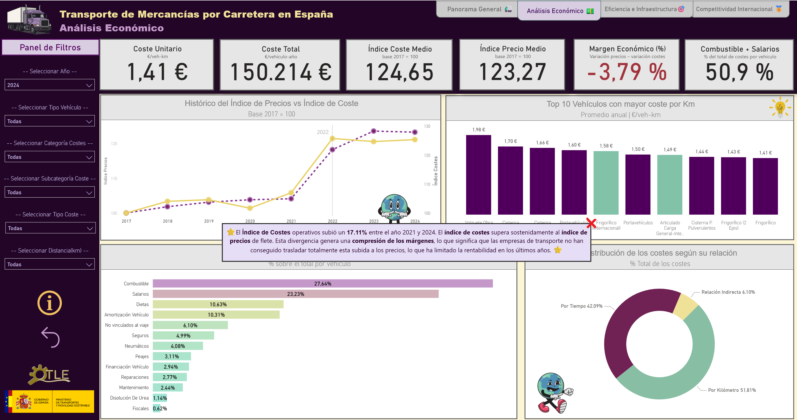
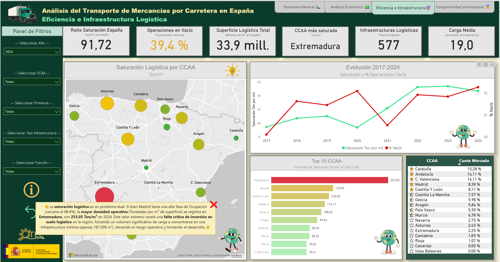
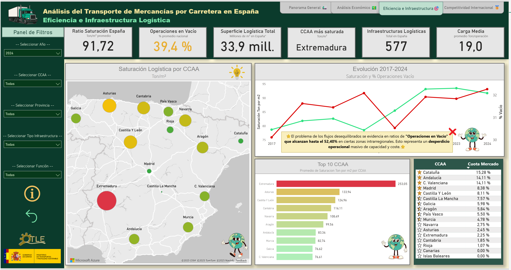
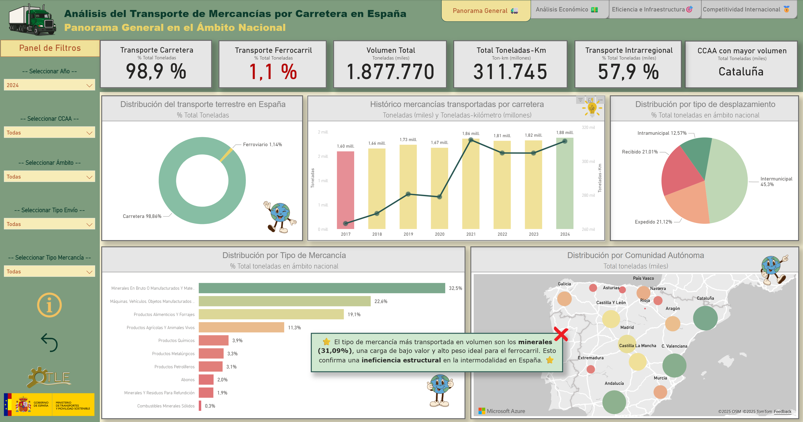
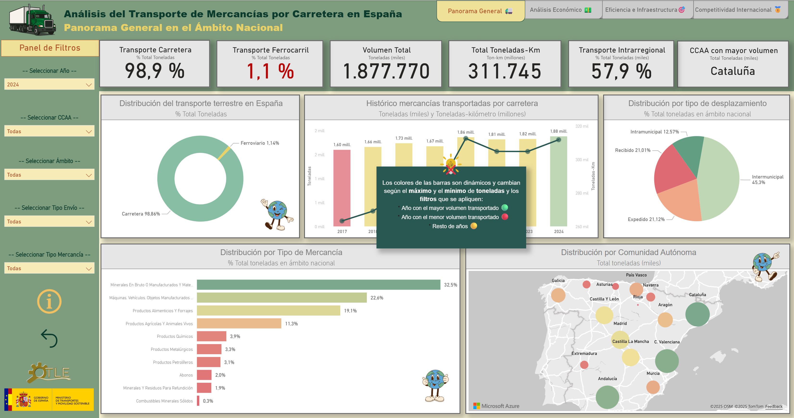
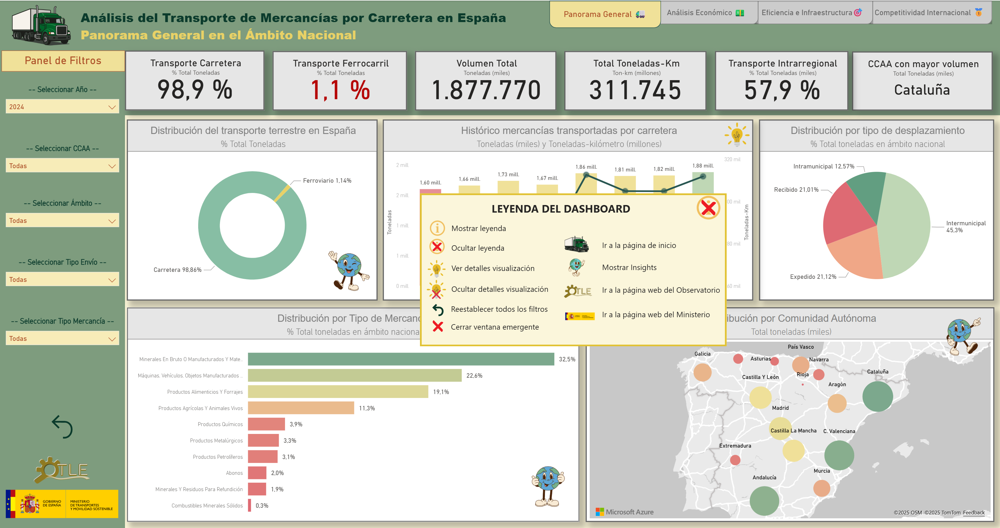
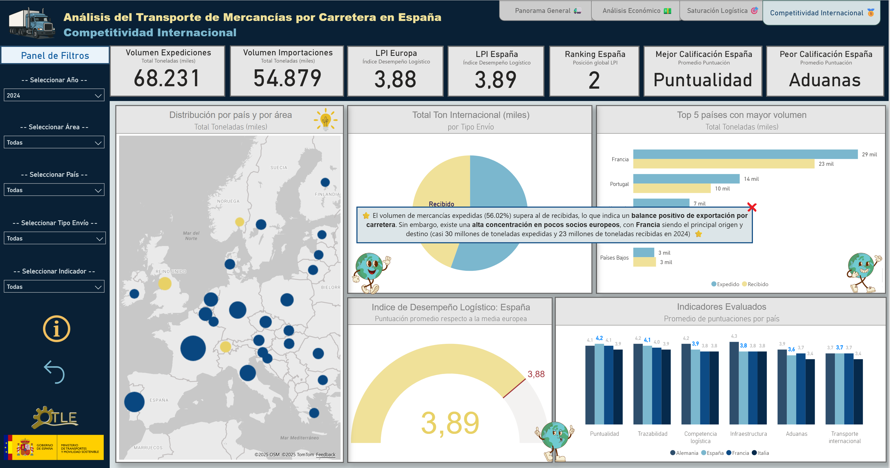
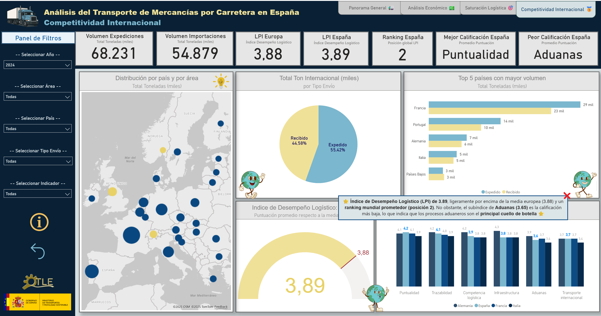
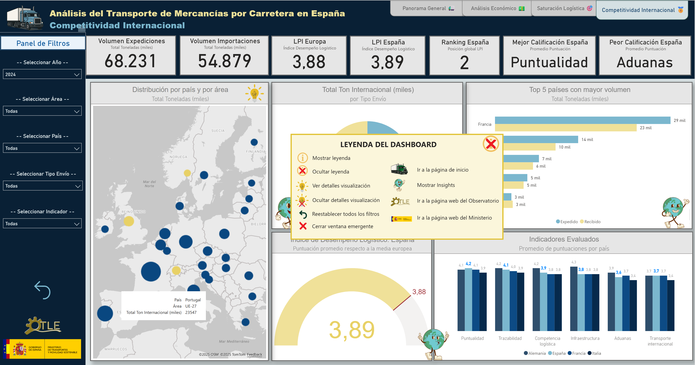
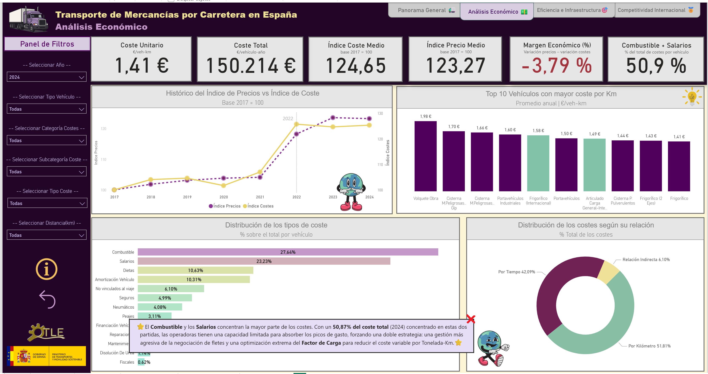

# 🚛 Análisis del Transporte de Mercancías por Carretera en España (2017–2024)


---

## 📊 Vista Previa del Dashboard

<p align="center">
  
</p>

> Dashboard interactivo desarrollado en Tableau para analizar **8 años de datos oficiales** (2017-2024) del Observatorio del Transporte y la Logística en España (MITMA). Incluye análisis de demanda, costes operativos, saturación de infraestructura logística y competitividad internacional.

📊 **[Ver presentación completa del proyecto](reports/transporte_mercancias_carretera.pptx)**  
📄 **[Leer informe técnico completo](reports/analisis_transporte_mercancias_carretera.pdf)**

---

## 🧭 Descripción General

Este proyecto transforma microdatos administrativos del **Ministerio de Transportes, Movilidad y Agenda Urbana (MITMA)** en un ecosistema de **Inteligencia de Negocio (BI)** que permite responder preguntas estratégicas sobre el sector logístico español:

### 🎯 Preguntas de Negocio Resueltas

* **Red y Flujos:** ¿Quién mueve qué y hacia dónde? (Matrices Origen-Destino entre comunidades autónomas)
* **Economía:** ¿Cómo evolucionan los márgenes del sector? ¿Existe presión inflacionaria en costes?
* **Infraestructura Logística:** ¿Dónde existen oportunidades de inversión en almacenes? (Ratio $Ton/m^2$)
* **Competitividad:** ¿Cómo se posiciona España frente a Europa en desempeño logístico?

🔗 **Fuente oficial de datos:** [Portal OTLE / MITMA](https://otle.transportes.gob.es/)

---

## 🔍 Principales Hallazgos

### 1️⃣ "Margin Squeeze" - Crisis de Rentabilidad del Sector

<p align="center">
  
</p>

**Descubrimiento crítico:** Los costes operativos crecieron un **24,65%** desde 2017, mientras que los precios de mercado solo aumentaron un **23,27%**, generando un margen económico negativo del **-3,79%**.

**Drivers de coste identificados:**
- **Combustible:** 27,64% del coste total
- **Salarios:** 23,23% del coste total
- **Combinado:** 50,9% del coste operativo total

⚠️ **Riesgo sistémico:** Este margen negativo es insostenible y previsiblemente conducirá a concentración empresarial y reducción de inversión en renovación de flotas.

---

### 2️⃣ Saturación Logística Desigual - Oportunidades de Inversión

<p align="center">
  
</p>

**Disparidad territorial extrema:**
- **Extremadura:** 253 Ton/m² (ratio crítico - infraestructura insuficiente)
- **Madrid:** 33 Ton/m² (sobrecapacidad instalada)
- **País Vasco/Cornisa Cantábrica:** >100 Ton/m² (demanda industrial alta + orografía limitante)

<p align="center">
  
</p>

💡 **Oportunidad estratégica:** Existe potencial de arbitraje logístico deslocalizando almacenaje desde zonas saturadas hacia zonas con capacidad disponible y buena conectividad (Castilla-La Mancha, Aragón).

**Insight adicional:** Las operaciones en vacío representan el **39,4%** del total nacional, evidenciando ineficiencias en la planificación de retornos con impacto directo en costes y emisiones.

<p align="center">
  
</p>

---

### 3️⃣ Concentración Geográfica - El "Triángulo de Oro"

<p align="center">
  
</p>

**Tres comunidades concentran el 43,5% del volumen total:**
- Cataluña: 15,28%
- Andalucía: 14,11%
- Comunitat Valenciana: 14,11%

Esta concentración define un **"Triángulo de Oro"** logístico en el arco mediterráneo correlacionado con:
- Puertos de alta capacidad (Barcelona, Valencia, Algeciras)
- Densidad industrial (cinturón industrial catalán, polo químico Tarragona)
- Producción agroindustrial (Almería, Murcia, Valencia)

<p align="center">
  
</p>

---

### 4️⃣ Dependencia Modal - 98,86% Carretera

<p align="center">
  
</p>

**Hallazgo:** Solo el **1,14%** del tráfico se realiza por ferrocarril (medido en número de operaciones). Esta ratio sitúa a España **por debajo de la media UE** (85% carretera / 15% ferrocarril).

**Causas identificadas:**
- Déficit histórico en infraestructura ferroviaria de mercancías
- Baja interoperabilidad de anchos de vía (Ibérico vs. UIC)
- Escasa inversión en terminales intermodales

---

### 5️⃣ España: Líder en Puntualidad, Rezagada en Facilitación Aduanera

<p align="center">
  
</p>

**Posicionamiento:** España ocupa la **posición 2 en el ranking global LPI** (Logistics Performance Index del Banco Mundial), pero con un perfil heterogéneo:

**Fortalezas:**
- **Puntualidad:** 4,10/5,00 - Supera a Francia (3,80) e Italia (3,40)
- **Trazabilidad:** 4,00/5,00 - En línea con estándares UE

**Debilidades:**
- **Aduanas:** 3,70/5,00 - Rezago respecto a Alemania (4,30) y Francia (4,10)
- **Transporte Internacional:** 3,70/5,00 - Penalizado por conectividad ferroviaria limitada

<p align="center">
  
</p>

💡 **Oportunidad de mejora:** Si España redujera los tiempos de despacho aduanero al nivel alemán, podría ganar 0,6 puntos en el LPI global, alcanzando potencialmente la 1ª posición europea.

---

### 6️⃣ Dependencia Comercial de Francia - Riesgo de Concentración

<p align="center">
  
</p>

**Francia concentra el 41% del volumen total de comercio exterior:**
- 29.000 toneladas expedidas (desde España)
- 23.000 toneladas recibidas (hacia España)

**Comparativa con otros socios:**
- Portugal: 24.000 toneladas (19%)
- Alemania: 13.000 toneladas (11%)
- Italia: 10.000 toneladas (8%)

⚠️ **Riesgo sistémico:** Hiperconcentración genera vulnerabilidad ante cambios regulatorios franceses o conflictos laborales en infraestructuras de paso.

---

## 🎨 Decisiones de Diseño UX - Sistema de Clasificación de Vehículos

<p align="center">
  
</p>

**Desafío:** El dataset CO614 contenía **21 tipos de vehículos** diferentes con nomenclaturas técnicas extensas. Presentar 21 colores habría generado saturación visual.

**Solución implementada:** Sistema de clasificación jerárquico de dos niveles:

### Nivel 1 - Categorías Macro (3 colores)
- 🟣 **Morado:** Vehículos especializados (ADR, ATP, construcción)
- 🟢 **Verde:** Vehículos internacionales (alto kilometraje: 150.000 km/año)
- 🔵 **Azul:** Carga general (polivalentes)

### Nivel 2 - Subgrupos Detallados (9 categorías)
Para análisis granular, cada categoría macro se subdivide manteniendo coherencia cromática con variaciones tonales.

**Paleta con significado semántico:**
- 🔴 **Rojo:** Mercancías Peligrosas (ADR) - Convención internacional de seguridad
- 🔵 **Azul claro:** Refrigerados (ATP) - Asociación con cadena de frío
- 🟤 **Beige:** Cisternas de granel - Materiales a granel
- ⚫ **Gris oscuro:** Industriales - Obra civil y construcción

✅ **Resultado:** Accesibilidad mejorada (contraste > 4.5:1 según WCAG 2.1 AA) y narrativa visual coherente entre páginas del dashboard.

---

## 🎯 Alcance y Limitaciones

### ✅ Alcance (Lo que SÍ incluye)

1. **Ventana Temporal:** Serie histórica completa **2017-2024**, permitiendo análisis pre y post-pandemia
2. **Modo de Transporte:** Foco principal en **Transporte por Carretera** (95% del movimiento interior)
3. **Granularidad Geográfica:**
    * *Flujos (Demanda):* Nivel Comunidad Autónoma (CCAA)
    * *Infraestructura (Oferta):* Nivel Provincia
4. **Dimensión Económica:** Estructura de costes desglosada por tipo de vehículo

### ⚠️ Limitaciones (Lo que NO incluye)

1. **Ceguera de "Última Milla":** Datos oficiales no trazan distribución capilar urbana (e-commerce B2C)
2. **Asimetría Geo-Espacial:** No es posible calcular centro de gravedad exacto dentro de una provincia
3. **Anonimato de Operadores:** Costes son medias sectoriales, sin datos financieros de empresas específicas
4. **Efecto 2020:** Año con anomalías estadísticas por COVID-19 (debe tratarse como outlier)

---

## 📊 Datasets Procesados

| Código | Descripción | Registros | Período |
|--------|-------------|-----------|---------|
| CO280  | Tráfico total de mercancías (por tipo y desplazamiento) | 15.200 | 2017-2024 |
| CO282  | Flujos nacionales entre comunidades autónomas | 8.800 | 2017-2024 |
| CO285  | Operaciones en vacío (eficiencia) | 1.728 | 2017-2024 |
| CO497  | Índice de precios del transporte | 480 | 2017-2024 |
| CO516  | Superficie de instalaciones logísticas | 3.816 | 2017 |
| CO519  | Tráfico total por modo de transporte | 240 | 2017-2024 |
| CO597  | Transporte internacional (tn / tn·km) | 1.920 | 2017-2024 |
| CO614  | Costes estructurales por tipo de vehículo | 3.360 | 2017-2024 |
| LPI    | Índice de desempeño logístico (Banco Mundial) | 32 | 2023 |

---

## 🎯 KPIs Estratégicos Generados

Como resultado del pipeline ETL, se crearon **7 datasets maestros** listos para visualización en Tableau:

| KPI | Descripción | Insight de Negocio |
|-----|-------------|-------------------|
| **KPI_Cuota_Mercado_CCAA** | Volumen total movido por región | Identificación del "Triángulo de Oro" logístico |
| **KPI_Costes_Historico_Vehiculos** | Desglose de costes operativos por tipo de camión | Análisis de rentabilidad por segmento de flota |
| **KPI_Precios_Mercado_Historico** | Índice de precios (Base 100 = 2017) | Detección del fenómeno "Margin Squeeze" |
| **KPI_Saturacion_Logistica_Historico** | Relación Ton/m² por comunidad | Mapa de oportunidades de inversión inmobiliaria |
| **KPI_Balanza_Comercial** | Flujos exportación vs. importación | Dependencia de socios comerciales (Francia 41%) |
| **KPI_Benchmarking_LPI** | Desempeño logístico España vs. Europa | Fortalezas (puntualidad) y debilidades (aduanas) |
| **KPI_Socios_Internacionales** | Ranking de países por volumen comercial | Estrategia de diversificación geográfica |

---

## ⚙️ Metodología: De Notebooks a Insights

| Fase | Notebook | Descripción Técnica | Output Generado |
|------|----------|-------------------|-----------------|
| **ETL** | `01_exploracion` | Mapeo de columnas y auditoría de nulos | Validación integridad datos (2017-2024) |
| **ETL** | `02_limpieza_I` | Pivoteo de métricas (Ton vs Ton-Km) | Red logística nacional (CO280, CO282) |
| **ETL** | `03_limpieza_II` | Desagregación de superficies y estandarización geográfica | Inventario suelo logístico (CO516) |
| **KPI** | `04_analisis_I` | Cálculo cuotas de mercado por CCAA | KPI_Cuota_Mercado_CCAA.csv |
| **KPI** | `05_analisis_II` | Comparativa Costes vs. Precios | KPI_Costes_Historico + KPI_Precios_Mercado |
| **KPI** | `06_analisis_III` | Matriz Saturación (Demanda / Oferta) | KPI_Saturacion_Logistica_Historico.csv |
| **KPI** | `07_analisis_IV` | Balanza comercial y LPI Benchmarking | KPI_Balanza_Comercial + KPI_Benchmarking_LPI |

---

## 🔧 Desafíos Técnicos Superados

### 🚨 Error de Interpretación Conceptual - Tráfico Internacional

**El problema:** Durante el desarrollo, asumí que el dataset CO597 "Tráfico Internacional" se refería a **vehículos operando rutas transfronterizas** (ej: Madrid-París). Esta interpretación errónea llevó a diseñar visualizaciones que mezclaban conceptos de "comercio exterior" con "operaciones de vehículos".

**La realidad:** CO597 registra **flujos de mercancías** (toneladas expedidas y recibidas) entre España y Europa, NO clasifica vehículos por ámbito operativo.

**Impacto:** Afectó a dos páginas del dashboard:
- **Panorama General:** Métrica "% Transporte Internacional" computaba incorrectamente (doble contabilidad)
- **Competitividad Internacional:** Confusión entre balanza comercial y operaciones de vehículos

**Solución implementada:**
1. Rediseñé la página "Panorama General" eliminando la métrica errónea
2. Reestructuré "Competitividad Internacional" para enfocarse exclusivamente en comercio exterior (expediciones vs. importaciones)
3. Validé definiciones operativas con documentación oficial MITMA/OTLE

**Lección aprendida:** En proyectos con datos administrativos complejos, la **validación semántica de las definiciones** es tan crítica como la limpieza técnica. Documentar asunciones conceptuales en fases tempranas previene rediseños costosos.

---

## 📂 Estructura del Proyecto

```
08_Transporte_Carretera_MITMA/
│
├── data/
│   ├── raw/                    # CSVs originales MITMA (no versionados)
│   └── processed/              # Datasets limpios para Tableau
│       ├── CO280_trafico_total_ccaa_clean.csv
│       ├── CO282_flujos_ccaa_origen_destino_clean.csv
│       ├── CO285_operaciones_vacio_clean.csv
│       ├── CO497_indice_precios_clean.csv
│       ├── CO516_superficies_logisticas_clean.csv
│       ├── CO519_transporte_por_modo_clean.csv
│       ├── CO597_transporte_internacional_clean.csv
│       ├── CO614_costes_estructura_clean.csv
│       ├── KPI_Cuota_Mercado_CCAA.csv
│       ├── KPI_Costes_Historico_Vehiculos.csv
│       ├── KPI_Precios_Mercado_Historico.csv
│       ├── KPI_Saturacion_Logistica_Historico.csv
│       ├── KPI_Balanza_Comercial.csv
│       ├── KPI_Benchmarking_LPI.csv
│       └── indice_desempeno_logistico_clean.csv
│
├── notebooks/
│   ├── 01_exploracion_CO280.ipynb
│   ├── 02_limpieza_parte_I.ipynb
│   ├── 03_limpieza_parte_II.ipynb
│   ├── 04_analisis_parte_I.ipynb
│   ├── 05_analisis_parte_II.ipynb
│   ├── 06_analisis_parte_III.ipynb
│   └── 07_analisis_parte_IV.ipynb
│
├── src/
│   └── limpieza.py              # Funciones reutilizables ETL
│
├── reports/
│   ├── analisis_transporte_mercancias_carretera.pdf
│   └── transporte_mercancias_carretera.pptx
│
├── dashboards/
│   ├── transporte_mercancias_carretera.twb      # Tableau Workbook
│   └── QR_code_dashboard.jpg                     # QR para acceso rápido
│
├── images/
│   └── dashboard/
│       ├── 00.portada/
│       ├── 01.panorama_general/
│       ├── 02.analisis_economico/
│       ├── 03.eficiencia_e_infraestructura/
│       └── 04.competitividad_internacional/
│
├── requirements.txt
└── README.md
```

---

## 🚀 Cómo Replicar este Proyecto

### 1️⃣ Clonar el Repositorio

```bash
git clone https://github.com/tu_usuario/08_Transporte_Carretera_MITMA.git
cd 08_Transporte_Carretera_MITMA
```

### 2️⃣ Crear Entorno Virtual (Python 3.13+)

```bash
# Windows
python -m venv .venv
.venv\Scripts\activate

# Linux/Mac
python3 -m venv .venv
source .venv/bin/activate
```

### 3️⃣ Instalar Dependencias

```bash
pip install -r requirements.txt
```

### 4️⃣ Descargar Datos MITMA

Visita [Portal OTLE](https://otle.transportes.gob.es/) y descarga los CSVs correspondientes a los códigos CO280, CO282, CO285, CO497, CO516, CO519, CO597 y CO614 para el período 2017-2024. Colócalos en la carpeta `data/raw/`.

### 5️⃣ Ejecutar Notebooks Secuencialmente

Abre Jupyter Lab y ejecuta los notebooks en orden:
1. `01_exploracion_CO280.ipynb`
2. `02_limpieza_parte_I.ipynb`
3. `03_limpieza_parte_II.ipynb`
4. `04_analisis_parte_I.ipynb`
5. `05_analisis_parte_II.ipynb`
6. `06_analisis_parte_III.ipynb`
7. `07_analisis_parte_IV.ipynb`

### 6️⃣ Abrir Dashboard en Tableau

Abre el archivo `dashboards/transporte_mercancias_carretera.twb` con Tableau Desktop y conecta a los CSVs de la carpeta `data/processed/`.

---

## 🛠️ Tecnologías Utilizadas

- **Python 3.13:** Limpieza y procesamiento de datos
  - pandas 2.1.4 (manipulación de datos)
  - numpy 1.26.2 (cálculos numéricos)
  - matplotlib 3.8.2 (visualizaciones exploratorias)
  - seaborn 0.13.0 (visualizaciones estadísticas)
- **Tableau Desktop 2024:** Visualización interactiva y storytelling
- **Git/GitHub:** Control de versiones
- **VS Code:** Entorno de desarrollo con extensiones Jupyter, Python
- **Microsoft PowerPoint:** Presentación ejecutiva del proyecto
- **Microsoft Word:** Informe técnico completo

---

## 📧 Contacto

**Elena Sánchez-Laulhé Dégano**  
📍 Madrid, España  
📧 esanchezlaulhe@gmail.com  
💼 [LinkedIn](https://www.linkedin.com/in/tu-perfil)  
🐙 [GitHub](https://github.com/tu-usuario)

---

## 🧾 Licencia de los Datos

Los datos utilizados proceden del **Ministerio de Transportes, Movilidad y Agenda Urbana (MITMA)** – **Observatorio del Transporte y la Logística en España (OTLE)**, y se reutilizan conforme a su **Licencia de datos abiertos (LDA)**:  
👉 [https://www.transportes.gob.es/el-ministerio/buen-gobierno/licencia_datos](https://www.transportes.gob.es/el-ministerio/buen-gobierno/licencia_datos)

---

## 🏆 Reconocimientos

Este proyecto es el resultado de un proceso de aprendizaje intensivo en:
- Ingeniería de datos aplicada al sector logístico
- Diseño de dashboards con principios UX/UI
- Narrativa visual con datos (data storytelling)
- Validación de asunciones conceptuales en datasets complejos

Agradecimientos especiales al equipo del OTLE por mantener datasets de calidad y acceso público.

---

<p align="center">
  <strong>📚 Proyecto educativo y de investigación | 2024</strong>
</p>
